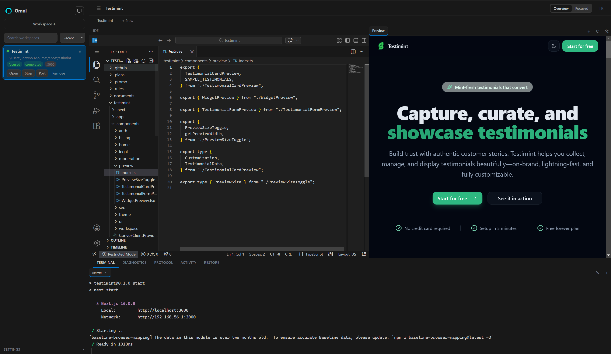
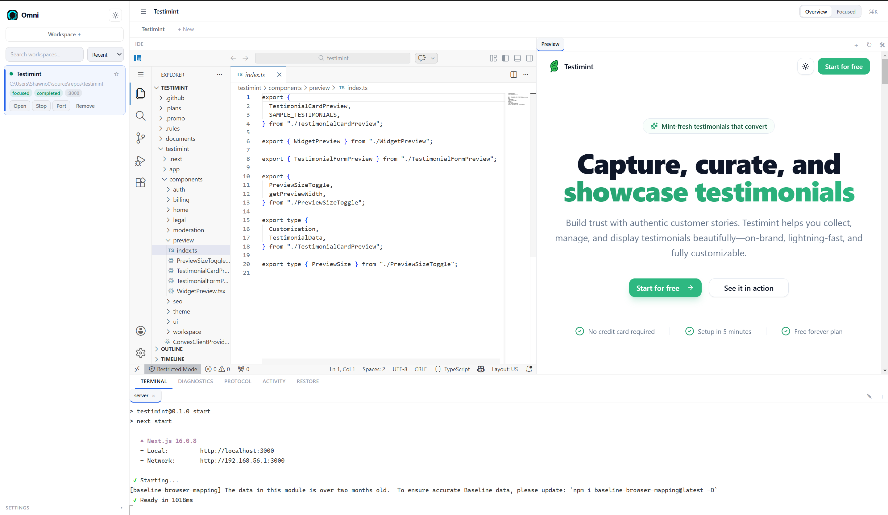

# Omni

Omni is a desktop developer workspace supervisor that runs multiple isolated project sessions in one app.

It combines:
- an Electron shell,
- embedded code-server IDE sessions,
- per-workspace preview/browser tabs,
- per-workspace multi-terminal tabs,
- persisted workspace/session state.

## Features

- Multi-workspace management (create, start, stop, reopen)
- Isolated workspace sessions with dedicated partitions
- Embedded IDE per workspace (code-server)
- Multi-terminal tabs per workspace (create, rename, switch, close)
- Browser/preview tabs per workspace with persistence
- Workspace activity monitoring (focused/background/idle + terminal progress)

## Tech Stack

- Node.js + npm workspaces
- TypeScript
- Electron
- code-server (bundled runtime)
- xterm.js for terminal surfaces

## Repository Layout

- `apps/desktop` — Electron desktop app
- `packages/shared` — shared contracts/types
- `packages/omni-bridge` — VS Code extension package

## Prerequisites

- Node.js 20+
- npm 10+
- Windows/macOS/Linux supported by Electron + Node toolchain

## Getting Started

From repository root:

```bash
npm install
npm run build
```

Run the desktop app in development mode:

```bash
npm run dev
```

## Common Scripts

From repository root:

- `npm run dev` — build and launch desktop app
- `npm run build` — build all workspaces/packages
- `npm run typecheck` — run type checks across workspaces
- `npm run update:code-server` — force refresh bundled code-server runtime

Desktop-only (workspace selector):

- `npm run build -w @omni/desktop`
- `npm run dev -w @omni/desktop`
- `npm run package:win -w @omni/desktop`
- `npm run package:linux -w @omni/desktop`
- `npm run package:mac -w @omni/desktop`

## Build and Packaging

### Desktop build

```bash
npm run build -w @omni/desktop
```

### Windows installer

```bash
npm run package:win -w @omni/desktop
```

### Linux installer/package

```bash
npm run package:linux -w @omni/desktop
```

### macOS installer/package

```bash
npm run package:mac -w @omni/desktop
```

Installer output is written to `apps/desktop/out`.

Note: build each target on its native OS when possible (Windows on Windows, Linux on Linux, macOS on macOS).

## Environment Variables

- `OMNI_CODE_SERVER_BIN` (optional): custom path to a code-server executable.

If not set, Omni uses the bundled runtime under `apps/desktop/vendor/code-server`.

## Security Notes

- Workspace sessions are isolated and run with per-workspace partitions.

## Preview




